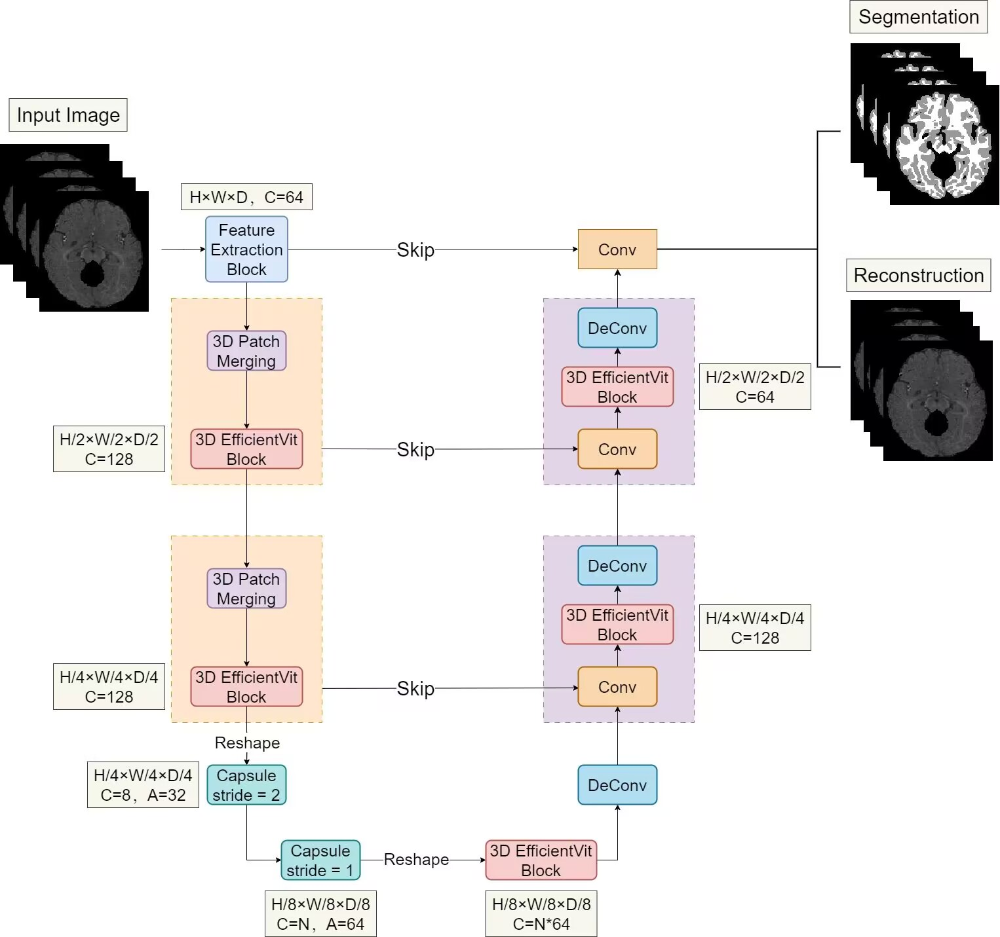
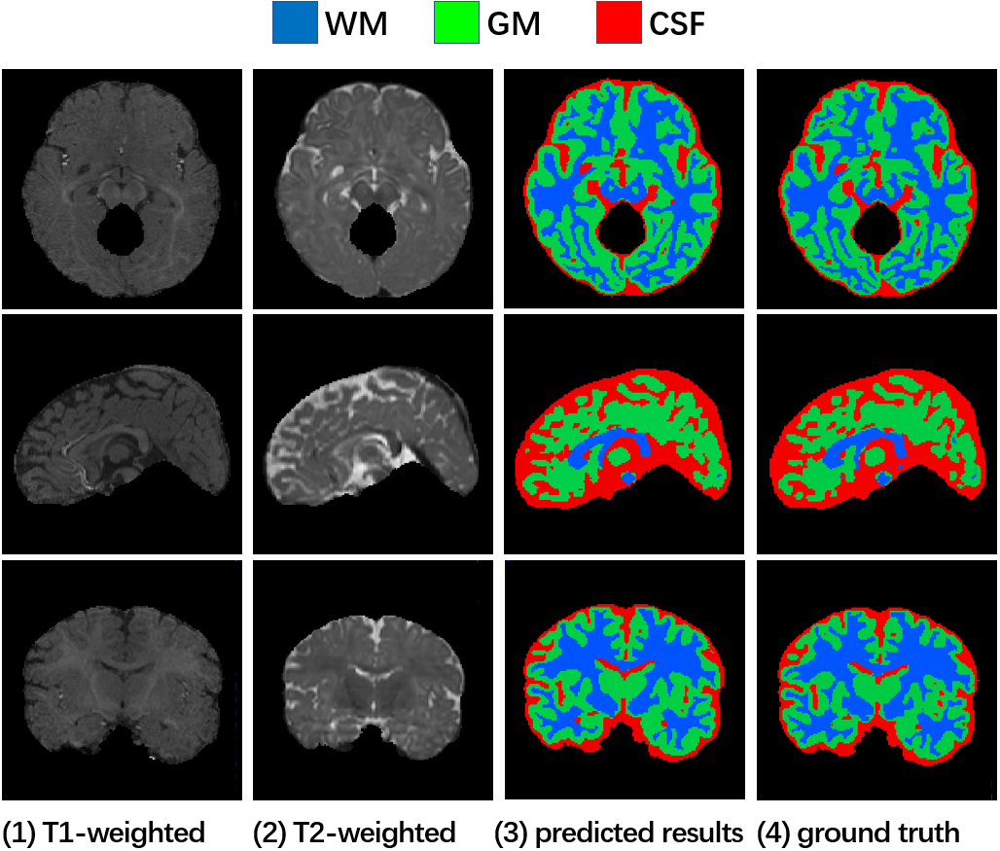

# 3D-EffiViTCaps: 3D Effcient Vision Transformer with Capsule for Medical Image Segmentation
Table of Contents
* [Introduction](#introduction)
* [Usage](#usage)
* [Trained models](#trained-models)
* [Acknowledgement](#acknowledgement)
* [Citation](#citation)

# Introduction


The figure above illustrates our 3D-EffiViTCaps architecture. Details about it are described in our paper [here](). The main implementation of this whole network can be found [here](module/effiViTcaps.py). In addition, the implementation of 3D Patch Merging block and 3D EfficientViT block can be find [here](main_block/efficientViT3D.py). A visualization example is shown below.



## Usage

### Installation
- Clone the repository:
```
git clone https://github.com/HidNeuron/3D-EffiViTCaps.git
```

- Install dependencies depends on your cuda version (CUDA 10 or CUDA 11)
```
conda env create -f environment_cuda10.yml
```
or
```
conda env create -f environment_cuda11.yml
```

### Data preparation
Our method is evaluated on three datasets:
* iSeg-2017 challenge (infant brain MRI segmentation): <https://iseg2017.web.unc.edu/download/>
* Cardiac and Hippocampus dataset from Medical Segmentation Decathlon: <http://medicaldecathlon.com/>

The directory structure of the dataset is expected to be the following:
```
path/to/iseg/
  domainA/
  domainA_val/

path/to/cardiac/
  imagesTr
  labelsTr

path/to/hippocampus/
  imagesTr
  labelsTr
```

### Training
For train.py and effiViTcaps.py, the args are set respectively as follows:
1. train.py:
   * basic arguments: `gpus`, `root_dir`, `log_dir`, `dataset`, `fold`, `cache_rate`, `cache_dir`, `model_name`, `train_patch_size`, `num_workers`, `batch_size`, `num_samples`.
   * arguments for [Trainer](https://pytorch-lightning.readthedocs.io/en/latest/common/trainer.html#trainer-class-api) class from Pytorch Lightning: `benchmark`, `logger`, `callbacks`, `num_sanity_val_steps`, `accelerator`,  `max_epochs`, `terminate_on_nan`, `check_val_every_n_epoch`.

2. effiViTcaps.py:
   * network arguments: `in_channels`, `out_channels`, `val_frequency`, `val_patch_size`, `sw_batch_size`, `overlap`.

The training example script is available [here](scripts/train_3d_effiViTcaps.sh)

### Evaluation
For effiViTcaps.py, the args are set referring to [Training](#training). For evaluate.py, the args are set as follows:
   * basic arguments: `root_dir`, `save_image`, `output_dir`,  `model_name`, `dataset`, `fold`, `checkpoint_path`.

The evaluating example script is available [here](scripts/eval_3d_effiViTcaps.sh)


## Trained models
Our trained 3D-EffiViTCaps models on three datasets can be downloaded as follows: 

- [iSeg-2017](https://pan.baidu.com/disk/main?_at_=1707066763547#/index?category=all&path=%2F3D-EffiViTCaps-checkpoints%2Fiseg2017)
- [Hippocampus](https://pan.baidu.com/disk/main?_at_=1707066763547#/index?category=all&path=%2F3D-EffiViTCaps-checkpoints%2Fhippocampus)
- [Cardiac](https://pan.baidu.com/disk/main?_at_=1707066763547#/index?category=all&path=%2F3D-EffiViTCaps-checkpoints%2Fcardiac)

## Acknowledgement
The implementation makes liberal use of code from [3DConvCaps](https://github.com/UARK-AICV/3DConvCaps) and [EfficientViT](https://github.com/microsoft/Cream/tree/main/EfficientViT).

## Citation
```
@article{

}
```
## Contacts
We are honored to help you if you have any questions. Please feel free to open an issue or contact us directly. Hope our code helps and look forward to your citations.
